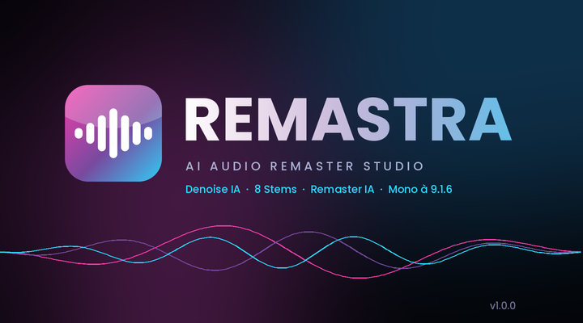

<p align="center">
  
</p>

<p align="center">
  <b>AI Denoise · 8 or 53 AI Stems · AI Remaster · WAV/FLAC export from mono to 9.1.6</b><br>
  
  
  
</p>

# REMASTRA — AI Audio Remaster Studio

Audio remastering software for music, dubbing, voice and video soundtracks.

| AI Remaster | 53 AI Stems | Multichannel export |
|---|---|---|
|  |  |  |

The interface is available in **English** and **French**: pick your language each time REMASTRA starts.

<p align="center"></p>

## Getting started (Windows 10/11, 64-bit)

1. Download `REMASTRA-vX.Y.Z-windows-x64.zip` from the **[Releases](../../releases)** page and extract it anywhere (e.g. `C:\REMASTRA`).
2. Double-click **`Remastra.exe`**.
3. On first launch, choose your language (English / Français). The launcher then offers to install the required components: Python 3.11 (through winget if it is missing), the user interface, PyTorch (the NVIDIA GPU build if a card is detected, otherwise the CPU build), Demucs and DeepFilterNet. The AI models are downloaded at the end.
   You will need about 3–6 GB of disk space and an Internet connection.
4. After that, every launch opens the language picker, then the interface, with no console window. Tick *Don't ask again* to always use the same language; the 🌐 button in the top bar switches language at any time (the app restarts).

You can also drag an audio file onto `Remastra.exe` to open it directly.

> Standalone build (no Python needed): after the first install, run `build_standalone.bat`. PyInstaller creates `dist\REMASTRA\REMASTRA.exe`.

## Workflow

| Step | What it does |
|---|---|
| ① Import & Analysis | Opens WAV, FLAC, MP3, OGG, OPUS, M4A, AAC, AIFF, WMA, MP4, MOV and MKV. Measures loudness (EBU R128 / ITU-R BS.1770-4), 4× true peak, LRA, crest factor, stereo correlation and the spectrum. Detects whether the content is voice or music. |
| ② AI Denoise | **DeepFilterNet 3**: neural speech enhancement at 48 kHz. **Demucs voice isolation**: removes music, ambience and crowd noise behind the voice, with an adjustable background level. **Spectral Pro**: Ephraim-Malah MMSE log-spectral estimator with speech presence probability; it can learn the noise profile from a region you select with the mouse. Restoration tools: rumble filter, 50/60 Hz de-hum (8 harmonics), de-click, de-esser. |
| ③ AI Stems | Two models. **Demucs v4**: 8 fast stems (vocals, drums, bass, guitar, piano, strings, pads, synths). **MVSep Mega BS-RoFormer**: up to **53 instruments** (lead vocal, backing vocals, kick, snare, hi-hat, toms, violin, viola, cello, trumpet, trombone, saxophone, flute, organ, harp, accordion, sitar…). Each stem has mute/solo, a gain control and its own export. |
| ④ AI Remaster | Analysis and automatic choice among 10 profiles, linear-phase corrective EQ (8k-tap FIR), adaptive multiband compression, harmonic exciter, analog saturation, M/S stereo imaging with mono bass, glue compression, loudness normalization and a true-peak limiter. Every decision the engine makes is listed. Reference-track mastering is also available. |
| ⑤ Export | **WAV**: 16/24-bit PCM or 32-bit float, WAVE_FORMAT_EXTENSIBLE with a channel mask, automatic RF64 above 4 GB. **FLAC**: 16/24-bit. Channel layouts: **Mono, Stereo, 2.0, 2.1, 5.1, 7.1, 7.1.6, 9.1.6**. Spatialization uses the AI stems as objects, or a spectral direct/ambience upmix. TPDF dither and SoX VHQ resampling (44.1–192 kHz). |

Instant A/B listening (Original / Denoised / Master / Stem mix): click the buttons at the top of the window. The space bar starts and pauses playback.

## Technical notes

* **Stems**: Demucs v4 `htdemucs_6s` separates 6 sources. The strings, pads and synths stems are then extracted from Demucs's "other" track with time-frequency masks (harmonic/percussive, sustain, timbre). They are an **estimate** and are less precise than the 5 stems produced directly by the network. The 8 stems still add up exactly to the original mix.
* **53-stem model**: [`mvsep_mega_model_bs_roformer_53_stems_v1.ckpt`](https://github.com/ZFTurbo/Music-Source-Separation-Training/releases/tag/v1.0.21) by ZFTurbo / MVSep (BS-RoFormer, 681M parameters, MIT). It is not installed with the other components: download it (1.4 GB) from the Stems page, or point REMASTRA to a `.ckpt` you already have. It is stored in `%LOCALAPPDATA%\REMASTRA\models`.
  * The 53 stems **overlap** (e.g. "Vocals" contains lead vocal + backing vocals, "Drums" contains kick, snare, hi-hat…), so they do not add up to the mix. REMASTRA therefore enables a non-overlapping **main set** by default (vocals, drums, bass, guitar, piano, strings, synth + a computed "other" residual) that adds up exactly to the original. The detailed instruments are listed below it, muted by default. The main set is also what drives 5.1–9.1.6 spatialization.
  * Instruments that are absent from the track are hidden automatically (can be turned off).
  * An **NVIDIA GPU with 16 GB of VRAM** is recommended. "Economy" (10 s segments) and "Minimal" (5 s segments) memory modes allow smaller GPUs; the mode is chosen automatically from your VRAM. On CPU it works but is very slow (about 15× the track length on a 2-core machine).
* **FLAC**: the format is limited to 8 channels. For 7.1.6 (14 channels) and 9.1.6 (16 channels), REMASTRA therefore exports **multi-mono** FLAC: one file per channel, named `01_L`, `02_R`… The WAV export keeps all channels in a single file.
* **Channel order**: standard WAVE order up to 7.1, then Dolby Atmos order for layouts with height channels (`L R C LFE Lrs Rrs Lss Rss [Lw Rw] Ltf Rtf Ltm Rtm Ltr Rtr`). Every multichannel export comes with a `_channels.txt` file.
* **GPU**: NVIDIA (CUDA) cards are used automatically. On CPU, stem separation takes about 1–3× the track length in "High quality" mode.
* If an AI engine is missing or its model cannot be downloaded, REMASTRA falls back to the Spectral Pro engine. Engine status is shown in the bottom-left corner.

## Project structure

```
REMASTRA/
├── Remastra.exe          Windows launcher (shipped in releases)
├── install.bat           component installer
├── build_standalone.bat  standalone PyInstaller build
├── requirements*.txt
├── remastra/
│   ├── core/  audio_io, analysis, denoise, stems, mega, mastering, spatial, export
│   │   └── models/bs_roformer/  BS-RoFormer network (ZFTurbo, MIT)
│   ├── i18n.py  English / French translations
│   ├── gui/   app, lang_dialog, main_window, widgets, theme, workers
│   └── assets/ icon.ico, icon.png, splash.png
└── launcher/  C source of the launcher (MinGW-w64)
```

## Development

```bash
git clone <repo-url> && cd REMASTRA
pip install -r requirements.txt torch torchaudio -r requirements-ai.txt
python -m remastra              # shows the language picker
python -m remastra --lang en    # or force a language (en / fr)
```

* Build the launcher: `sh launcher/build_launcher.sh` (Linux, MinGW-w64) or `launcher\build_launcher.bat` (Windows, MinGW).
* Publish a release: `git tag v1.2.0 && git push origin v1.2.0`. The GitHub Actions workflow compiles `Remastra.exe` and creates the release with the Windows archive and `RELEASE_NOTES.md`.

## Credits

* [Demucs](https://github.com/facebookresearch/demucs) (Meta AI): source separation
* [MVSep Mega BS-RoFormer 53 stems](https://github.com/ZFTurbo/Music-Source-Separation-Training) (ZFTurbo / MVSep, MIT): 53-instrument separation. The BS-RoFormer code in `remastra/core/models/bs_roformer` is vendored from that repository.
* [DeepFilterNet](https://github.com/Rikorose/DeepFilterNet): speech denoising
* [PySide6 / Qt](https://www.qt.io/qt-for-python), [pedalboard](https://github.com/spotify/pedalboard), [python-soxr](https://github.com/dofuuz/python-soxr), NumPy, SciPy

## License

MIT, see [LICENSE](LICENSE). The Demucs (MIT), MVSep Mega BS-RoFormer (MIT) and DeepFilterNet (MIT/Apache-2.0) models are downloaded from their official repositories.
